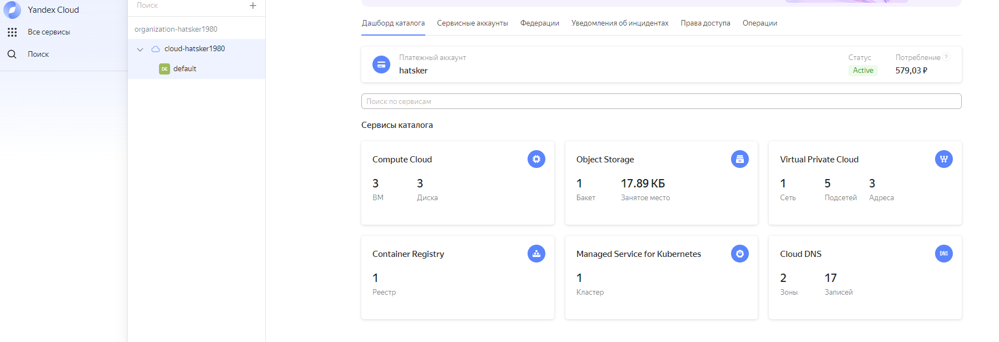
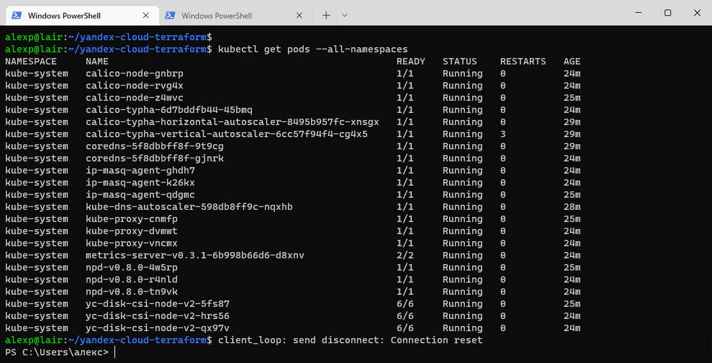
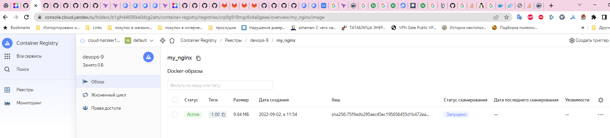
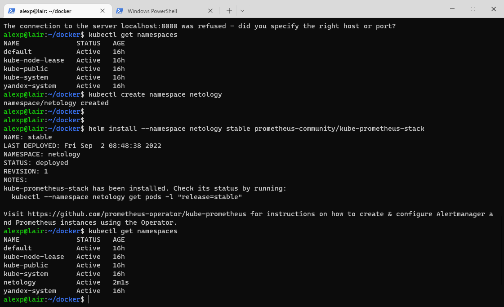
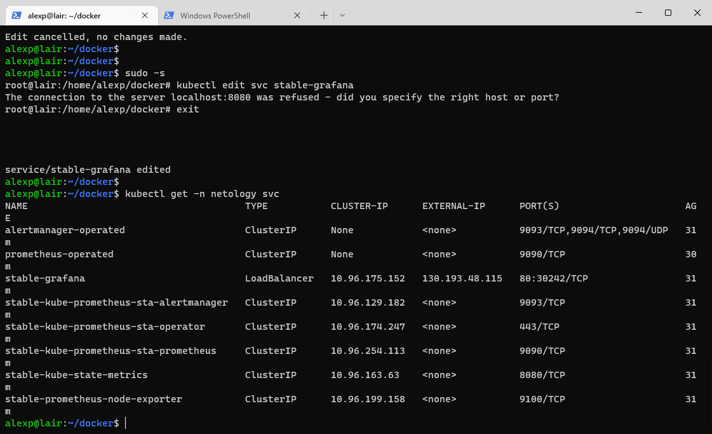
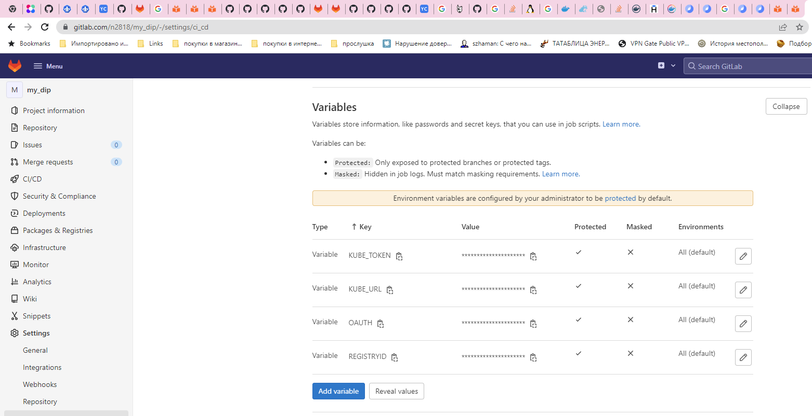
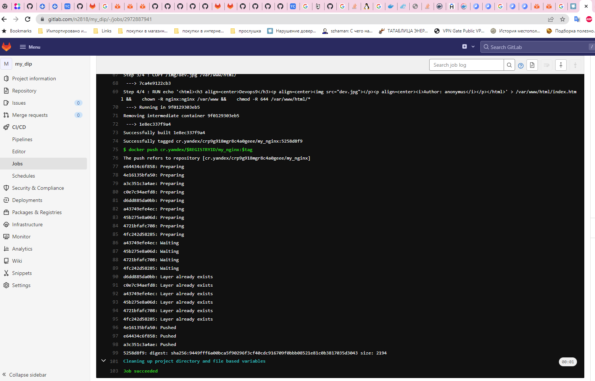
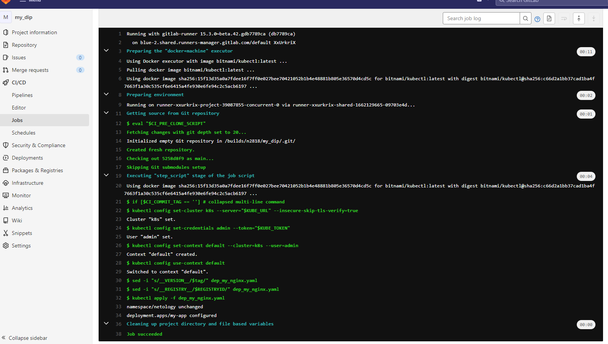

# Дипломный практикум в Яндекс.Облако
  * [Цели:](#цели)
  * [Этапы выполнения:](#этапы-выполнения)
     * [Создание облачной инфраструктуры](#создание-облачной-инфраструктуры)
     * [Создание Kubernetes кластера](#создание-kubernetes-кластера)
     * [Создание тестового приложения](#создание-тестового-приложения)
     * [Подготовка cистемы мониторинга и деплой приложения](#подготовка-cистемы-мониторинга-и-деплой-приложения)
     * [Установка и настройка CI/CD](#установка-и-настройка-cicd)
  * [Что необходимо для сдачи задания?](#что-необходимо-для-сдачи-задания)
  * [Как правильно задавать вопросы дипломному руководителю?](#как-правильно-задавать-вопросы-дипломному-руководителю)

---
## Цели:

1. Подготовить облачную инфраструктуру на базе облачного провайдера Яндекс.Облако.
2. Запустить и сконфигурировать Kubernetes кластер.
3. Установить и настроить систему мониторинга.
4. Настроить и автоматизировать сборку тестового приложения с использованием Docker-контейнеров.
5. Настроить CI для автоматической сборки и тестирования.
6. Настроить CD для автоматического развёртывания приложения.

---
## Этапы выполнения:

### Создание облачной инфраструктуры

Подготавливаю облачную инфраструктуру в ЯО при помощи terraform.

Предварительная подготовка к установке и запуску Kubernetes кластера.

1. Создайте сервисный аккаунт, который будет в дальнейшем использоваться Terraform для работы с инфраструктурой с необходимыми и достаточными правами. Не стоит использовать права суперпользователя
```bash
yc iam service-account create terraform
yc iam key create --service-account-name terraform -o terraform.json
yc config set service-account-key terraform.json
export TF_VAR_yc_token=$(yc iam create-token)
SERVICE_ACCOUNT_ID=$(yc iam service-account get --name terraform --format json | jq -r .id)
FOLDER_ID=$(yc iam service-account get --name terraform --format json | jq -r .folder_id)
yc resource-manager folder add-access-binding $FOLDER_ID --role editor --subject 
yc iam service-account add-access-binding $SERVICE_ACCOUNT_ID --role editor 
serviceAccount:$SERVICE_ACCOUNT_ID
```
2. Подготавливаю backend на Terraform Cloud 
#### backend.tf
```tf
# backend.tf
terraform {
  backend "s3" {
    endpoint = "storage.yandexcloud.net"
    bucket   = "hatskerbucket"
    key        = "diplom/terraform.tfstate" # path to my tfstate file in the bucket
    region     = "ru-central1-a"
    access_key = "YCAJEB55Oj2A066twt-wio17a"
    secret_key = "YCPXRiRvaB22cF8GN-8YK1aoFQYQ6Y7sJzO0Vha1"
    skip_region_validation      = true
    skip_credentials_validation = true
  }
}
```
```bash
$ cat ~/.terraformrc
credentials "app.terraform.io" {
token = "Place your token here"
}
```
3. Настраиваю workspaces  
```bash
$ terraform workspace new stage && terraform workspace new prod
Created and switched to workspace "stage"!

You're now on a new, empty workspace. Workspaces isolate their state,
so if you run "terraform plan" Terraform will not see any existing state
for this configuration.
Created and switched to workspace "prod"!

You're now on a new, empty workspace. Workspaces isolate their state,
so if you run "terraform plan" Terraform will not see any existing state
for this configuration.
$ terraform workspace select stage
Switched to workspace "stage".
```
4. Создаю VPC с подсетями в разных зонах доступности.
#### networks.tf
```resource "yandex_vpc_network" "k8s-network" {
  name = "yc-net"
}

resource "yandex_vpc_subnet" "public" {
  name           = "public0"
  zone           = var.zones[0]
  network_id     = yandex_vpc_network.k8s-network.id
  v4_cidr_blocks = var.public_v4_cidr_blocks[0]
}


resource "yandex_vpc_subnet" "private" {
  count          = local.private_subnets
  name           = "private${count.index}"
  zone           = var.zones[count.index]
  network_id     = yandex_vpc_network.k8s-network.id
  v4_cidr_blocks = var.private_v4_cidr_blocks[count.index]
  route_table_id = yandex_vpc_route_table.vpc-1-rt.id
}

resource "yandex_compute_instance" "nat-vm" {
  name        = "nat-instance"
  platform_id = "standard-v1"
  zone        = var.zones[0]

  resources {
    cores         = 2
    core_fraction = 20 
    memory        = 2
  }

  scheduling_policy {
    # !прерываемая!
    preemptible = (terraform.workspace == "stage") ? true : false
  }

  boot_disk {
    initialize_params {
      image_id = "fd80mrhj8fl2oe87o4e1" # nat-instance-ubuntu
    }
  }

  network_interface {
    subnet_id  = yandex_vpc_subnet.public.id
    ip_address = "192.168.10.254"
    nat        = true
  }

}

resource "yandex_vpc_route_table" "vpc-1-rt" {
  name       = "nat-gateway"
  network_id = yandex_vpc_network.k8s-network.id

  static_route {
    destination_prefix = "0.0.0.0/0"
    next_hop_address   = yandex_compute_instance.nat-vm.network_interface.0.ip_address
  }
}


```

5. Проверяю команду terraform apply без дополнительных ручных действий.

```

$ alexp@lair:~/yandex-cloud-terraform$ terraform apply

Terraform used the selected providers to generate the following execution plan. Resource actions are indicated with the
following symbols:
  + create

Terraform will perform the following actions:

  # yandex_compute_instance.nat-vm will be created
  + resource "yandex_compute_instance" "nat-vm" {
      + created_at                = (known after apply)
      + folder_id                 = (known after apply)
      + fqdn                      = (known after apply)
      + hostname                  = (known after apply)
      + id                        = (known after apply)
      + name                      = "nat-instance"
      + network_acceleration_type = "standard"
      + platform_id               = "standard-v1"
      + service_account_id        = (known after apply)
      + status                    = (known after apply)
      + zone                      = "ru-central1-a"

      + boot_disk {
          + auto_delete = true
          + device_name = (known after apply)
          + disk_id     = (known after apply)
          + mode        = (known after apply)

          + initialize_params {
              + block_size  = (known after apply)
              + description = (known after apply)
              + image_id    = "fd80mrhj8fl2oe87o4e1"
              + name        = (known after apply)
              + size        = (known after apply)
              + snapshot_id = (known after apply)
              + type        = "network-hdd"
            }
        }

      + network_interface {
          + index              = (known after apply)
          + ip_address         = "192.168.10.254"
          + ipv4               = true
          + ipv6               = (known after apply)
          + ipv6_address       = (known after apply)
          + mac_address        = (known after apply)
          + nat                = true
          + nat_ip_address     = (known after apply)
          + nat_ip_version     = (known after apply)
          + security_group_ids = (known after apply)
          + subnet_id          = (known after apply)
        }

      + placement_policy {
          + host_affinity_rules = (known after apply)
          + placement_group_id  = (known after apply)
        }

      + resources {
          + core_fraction = 20
          + cores         = 2
          + memory        = 2
        }

      + scheduling_policy {
          + preemptible = false
        }
    }

  # yandex_container_registry.diplom will be created
  + resource "yandex_container_registry" "diplom" {
      + created_at = (known after apply)
      + folder_id  = "b1glh44698ke0dcg2atn"
      + id         = (known after apply)
      + labels     = {
          + "my-label" = "diplom-app"
        }
      + name       = "devops-9"
      + status     = (known after apply)
    }

  # yandex_container_registry_iam_binding.pusher will be created
  + resource "yandex_container_registry_iam_binding" "pusher" {
      + id          = (known after apply)
      + members     = (known after apply)
      + registry_id = (known after apply)
      + role        = "editor"
    }

  # yandex_iam_service_account.k8s will be created
  + resource "yandex_iam_service_account" "k8s" {
      + created_at = (known after apply)
      + folder_id  = "b1glh44698ke0dcg2atn"
      + id         = (known after apply)
      + name       = "k8s"
    }

  # yandex_iam_service_account.pusher will be created
  + resource "yandex_iam_service_account" "pusher" {
      + created_at = (known after apply)
      + folder_id  = "b1glh44698ke0dcg2atn"
      + id         = (known after apply)
      + name       = "pusher"
    }

  # yandex_kubernetes_cluster.k8s-yandex will be created
  + resource "yandex_kubernetes_cluster" "k8s-yandex" {
      + cluster_ipv4_range       = (known after apply)
      + cluster_ipv6_range       = (known after apply)
      + created_at               = (known after apply)
      + description              = "k8s cluster"
      + folder_id                = (known after apply)
      + health                   = (known after apply)
      + id                       = (known after apply)
      + labels                   = {
          + "my_key"       = "my_value"
          + "my_other_key" = "my_other_value"
        }
      + log_group_id             = (known after apply)
      + name                     = "k8s-yandex"
      + network_id               = (known after apply)
      + network_policy_provider  = "CALICO"
      + node_ipv4_cidr_mask_size = 24
      + node_service_account_id  = (known after apply)
      + release_channel          = "STABLE"
      + service_account_id       = (known after apply)
      + service_ipv4_range       = (known after apply)
      + service_ipv6_range       = (known after apply)
      + status                   = (known after apply)

      + master {
          + cluster_ca_certificate = (known after apply)
          + external_v4_address    = (known after apply)
          + external_v4_endpoint   = (known after apply)
          + internal_v4_address    = (known after apply)
          + internal_v4_endpoint   = (known after apply)
          + public_ip              = true
          + version                = "1.21"
          + version_info           = (known after apply)

          + maintenance_policy {
              + auto_upgrade = true

              + maintenance_window {
                  + day        = "friday"
                  + duration   = "4h30m"
                  + start_time = "02:00"
                }
              + maintenance_window {
                  + day        = "monday"
                  + duration   = "3h"
                  + start_time = "01:00"
                }
            }

          + regional {
              + region = (known after apply)

              + location {
                  + subnet_id = (known after apply)
                  + zone      = (known after apply)
                }
            }

          + zonal {
              + subnet_id = (known after apply)
              + zone      = "ru-central1-a"
            }
        }
    }

  # yandex_kubernetes_node_group.node_group1 will be created
  + resource "yandex_kubernetes_node_group" "node_group1" {
      + cluster_id        = (known after apply)
      + created_at        = (known after apply)
      + description       = "worker nodes"
      + id                = (known after apply)
      + instance_group_id = (known after apply)
      + labels            = {
          + "key" = "value"
        }
      + name              = "node-group1"
      + status            = (known after apply)
      + version           = "1.21"
      + version_info      = (known after apply)

      + allocation_policy {
          + location {
              + subnet_id = (known after apply)
              + zone      = "ru-central1-a"
            }
          + location {
              + subnet_id = (known after apply)
              + zone      = "ru-central1-b"
            }
          + location {
              + subnet_id = (known after apply)
              + zone      = "ru-central1-c"
            }
        }

      + deploy_policy {
          + max_expansion   = (known after apply)
          + max_unavailable = (known after apply)
        }

      + instance_template {
          + metadata                  = (known after apply)
          + nat                       = (known after apply)
          + network_acceleration_type = (known after apply)
          + platform_id               = "standard-v1"

          + boot_disk {
              + size = 100
              + type = "network-hdd"
            }

          + container_runtime {
              + type = (known after apply)
            }

          + network_interface {
              + ipv4       = true
              + ipv6       = (known after apply)
              + nat        = false
              + subnet_ids = (known after apply)
            }

          + resources {
              + core_fraction = 5
              + cores         = 2
              + gpus          = 0
              + memory        = 2
            }

          + scheduling_policy {
              + preemptible = (known after apply)
            }
        }

      + maintenance_policy {
          + auto_repair  = true
          + auto_upgrade = true

          + maintenance_window {
              + day        = "friday"
              + duration   = "4h30m"
              + start_time = "1:00"
            }
          + maintenance_window {
              + day        = "monday"
              + duration   = "3h"
              + start_time = "5:00"
            }
        }

      + scale_policy {

          + fixed_scale {
              + size = 3
            }
        }
    }

  # yandex_resourcemanager_folder_iam_member.k8s-editor will be created
  + resource "yandex_resourcemanager_folder_iam_member" "k8s-editor" {
      + folder_id = "b1glh44698ke0dcg2atn"
      + id        = (known after apply)
      + member    = (known after apply)
      + role      = "editor"
    }

  # yandex_vpc_network.k8s-network will be created
  + resource "yandex_vpc_network" "k8s-network" {
      + created_at                = (known after apply)
      + default_security_group_id = (known after apply)
      + folder_id                 = (known after apply)
      + id                        = (known after apply)
      + labels                    = (known after apply)
      + name                      = "yc-net"
      + subnet_ids                = (known after apply)
    }

  # yandex_vpc_route_table.vpc-1-rt will be created
  + resource "yandex_vpc_route_table" "vpc-1-rt" {
      + created_at = (known after apply)
      + folder_id  = (known after apply)
      + id         = (known after apply)
      + labels     = (known after apply)
      + name       = "nat-gateway"
      + network_id = (known after apply)

      + static_route {
          + destination_prefix = "0.0.0.0/0"
          + next_hop_address   = "192.168.10.254"
        }
    }

  # yandex_vpc_subnet.private[0] will be created
  + resource "yandex_vpc_subnet" "private" {
      + created_at     = (known after apply)
      + folder_id      = (known after apply)
      + id             = (known after apply)
      + labels         = (known after apply)
      + name           = "private0"
      + network_id     = (known after apply)
      + route_table_id = (known after apply)
      + v4_cidr_blocks = [
          + "192.168.20.0/24",
        ]
      + v6_cidr_blocks = (known after apply)
      + zone           = "ru-central1-a"
    }

  # yandex_vpc_subnet.private[1] will be created
  + resource "yandex_vpc_subnet" "private" {
      + created_at     = (known after apply)
      + folder_id      = (known after apply)
      + id             = (known after apply)
      + labels         = (known after apply)
      + name           = "private1"
      + network_id     = (known after apply)
      + route_table_id = (known after apply)
      + v4_cidr_blocks = [
          + "192.168.40.0/24",
        ]
      + v6_cidr_blocks = (known after apply)
      + zone           = "ru-central1-b"
    }

  # yandex_vpc_subnet.private[2] will be created
  + resource "yandex_vpc_subnet" "private" {
      + created_at     = (known after apply)
      + folder_id      = (known after apply)
      + id             = (known after apply)
      + labels         = (known after apply)
      + name           = "private2"
      + network_id     = (known after apply)
      + route_table_id = (known after apply)
      + v4_cidr_blocks = [
          + "192.168.60.0/24",
        ]
      + v6_cidr_blocks = (known after apply)
      + zone           = "ru-central1-c"
    }

  # yandex_vpc_subnet.public will be created
  + resource "yandex_vpc_subnet" "public" {
      + created_at     = (known after apply)
      + folder_id      = (known after apply)
      + id             = (known after apply)
      + labels         = (known after apply)
      + name           = "public0"
      + network_id     = (known after apply)
      + v4_cidr_blocks = [
          + "192.168.10.0/24",
        ]
      + v6_cidr_blocks = (known after apply)
      + zone           = "ru-central1-a"
    }

Plan: 14 to add, 0 to change, 0 to destroy.

Changes to Outputs:
  + cluster_external_v4_endpoint = (known after apply)
  + cluster_id                   = (known after apply)
  + registry_id                  = (known after apply)

Do you want to perform these actions?
  Terraform will perform the actions described above.
  Only 'yes' will be accepted to approve.

  Enter a value: yes
```
---
### Создание Kubernetes кластера
Cоздаю Kubernetes кластер на базе предварительно созданной инфраструктуры используя Yandex Managed Service for Kubernetes
#### cluster.tf
```
resource "yandex_kubernetes_cluster" "k8s-yandex" {
  name        = "k8s-yandex"
  description = "k8s cluster"

  network_id = yandex_vpc_network.k8s-network.id

  master {
    version   = "1.21"
    public_ip = true

    zonal {
      zone      = var.zones[0]
      subnet_id = yandex_vpc_subnet.private[0].id
    }

    maintenance_policy {
      auto_upgrade = true

      maintenance_window {
        day        = "monday"
        start_time = "01:00"
        duration   = "3h"
      }

      maintenance_window {
        day        = "friday"
        start_time = "02:00"
        duration   = "4h30m"
      }
    }
  }

  service_account_id      = "${yandex_iam_service_account.k8s.id}"
  node_service_account_id = "${yandex_iam_service_account.pusher.id}"
  labels = {
    my_key       = "my_value"
    my_other_key = "my_other_value"
  }

  release_channel = "STABLE"
  network_policy_provider = "CALICO"
}
```
Создаю воркеры
#### k8s-nodes.tf
```
resource "yandex_kubernetes_node_group" "node_group1" {
  cluster_id  = yandex_kubernetes_cluster.k8s-yandex.id
  name        = "node-group1"
  description = "worker nodes"
  version     = "1.21"

  labels = {
    "key" = "value"
  }

  instance_template {
    platform_id = "standard-v1"

    network_interface {
      nat = false # Provide a public address, for instance, to access the internet over NAT
      subnet_ids = [yandex_vpc_subnet.private[0].id, yandex_vpc_subnet.private[1].id, yandex_vpc_subnet.private[2].id]
    }

    resources {
      memory        = 2
      cores         = 2
      core_fraction = 5 
    }

    boot_disk {
      type = "network-hdd"
      size = 100
    }

  }

  scale_policy {
    fixed_scale {
      size = 3
    }
  }

  allocation_policy {
    location {
      zone = var.zones[0]
    }
    location {
      zone = var.zones[1]
    }
    location {
      zone = var.zones[2]
    }
  }

  maintenance_policy {
    auto_upgrade = true
    auto_repair  = true

    maintenance_window {
      day        = "monday"
      start_time = "5:00"
      duration   = "3h"
    }

    maintenance_window {
      day        = "friday"
      start_time = "1:00"
      duration   = "4h30m"
    }
  }
}
```
Получаю адрес и id кластера
#### outputs.tf
```
output "cluster_external_v4_endpoint" {
  value = yandex_kubernetes_cluster.k8s-yandex.master.0.external_v4_endpoint
}

output "cluster_id" {
  value = yandex_kubernetes_cluster.k8s-yandex.id
}
output "registry_id" {
  description = "registry ID"
  value       = yandex_container_registry.diplom.id
}
```
Создаю конфиг kubernetes
```bash
$ yc managed-kubernetes cluster get-credentials --id $(terraform output -json cluster_id | sed 's/\"//g') --external

Context 'yc-k8s-yandex' was added as default to kubeconfig '/home/alexp/.kube/config'.
Check connection to cluster using 'kubectl cluster-info --kubeconfig /home/alexp/.kube/config'.

Note, that authentication depends on 'yc' and its config profile 'default'.
To access clusters using the Kubernetes API, please use Kubernetes Service Account.
```



Команда `kubectl get pods --all-namespaces`.

---
### Создание тестового приложения
1. Git репозиторий с тестовым приложением и Dockerfile.
[nginx](https://github.com/hatsker414/nginx)

2. Регистр с собранным docker image. 

---
### Подготовка cистемы мониторинга и деплой приложения

# Деплою в кластер prometheus-stack
1. Cтавим helm ```sudo snap install helm --classic```

```bash
 kubectl create namespace netology
$ helm repo add prometheus-community https://prometheus-community.github.io/helm-charts
$ helm install --namespace netology stable prometheus-community/kube-prometheus-stack
```


переключаемся на namespace netology 
``` kubectl config set-context --current --namespace=netology```

Настраиваю Grafana на LoadBalancer.
```bash
$ KUBE_EDITOR="nano" kubectl edit svc stable-grafana
```
```yaml
  selector:
    app.kubernetes.io/instance: stable
    app.kubernetes.io/name: grafana
  sessionAffinity: None
  type: ClusterIP
status:
  loadBalancer: {}
```
Меняю на 
```yaml
  selector:
    app.kubernetes.io/instance: stable
    app.kubernetes.io/name: grafana
  sessionAffinity: None
  type: LoadBalancer
```



[Grafana admin panel](http://130.193.39.182/d/efa86fd1d0c121a26444b636a3f509a8/kubernetes-compute-resources-cluster?orgId=1&refresh=10s)
admin
prom-operator

Деплоим приложение 

```kubectl apply -f dep_my_nginx.yaml```

```commandline
apiVersion: v1
kind: Namespace
metadata:
  name: netology
---
kind: Deployment
apiVersion: apps/v1
metadata:
  name: my-app
  namespace: netology
  labels:
    k8s-app: my-app
spec:
  replicas: 2
  selector:
    matchLabels:
      k8s-app: my-app
  template:
    metadata:
      name: my-app
      labels:
        k8s-app: my-app
    spec:
      containers:
      - name: my-nginx
        image: cr.yandex/crp8kad42eejq4kdj862/my_nginx:1.01
        imagePullPolicy: Always
        ports:
        - containerPort: 80
---
kind: Service
apiVersion: v1
metadata:
  name: nginx-my
  namespace: netology
  labels:
    k8s-app: my-app
spec:
  ports:
  - protocol: TCP
    port: 80
  selector:
    k8s-app: my-app
  type: LoadBalancer
```


[опубликованое приложение](http://51.250.39.170 /)


### Установка и настройка CI/CD

Настраиваю CI/CD GitLab

[Репозиторий](https://gitlab.com/n2818/my_dip/-/tree/main)

1. Настройка gitlab:
```bash
$ kubectl -n kube-system get secrets -o json | \
> jq -r '.items[] | select(.metadata.name | startswith("gitlab-admin")) | .data.token' | \
> base64 --decode 
```
Устанавливаю переменные:


KUBE_TOKEN - token пользователя terraform  
KUBE_URL - адрес кластера  
REGISTRYID - id Container Registry  
OAUTH - oauth token для авторизации в yc    

Интерфейс ci/cd сервиса доступен по [ссылке](https://gitlab.com/n2818/my_dip)  
При любом коммите в репозиторие с тестовым приложением происходит сборка и отправка в регистр Docker образа.  






## Что необходимо для сдачи задания?

1. Репозиторий с конфигурационными файлами Terraform и готовность продемонстрировать создание всех ресурсов с нуля.
2. Пример pull request с комментариями созданными atlantis'ом или снимки экрана из Terraform Cloud.
3. Репозиторий с конфигурацией ansible, если был выбран способ создания Kubernetes кластера при помощи ansible.
4. Репозиторий с Dockerfile тестового приложения и ссылка на собранный docker image.
5. Репозиторий с конфигурацией Kubernetes кластера.
6. Ссылка на тестовое приложение и веб интерфейс Grafana с данными доступа.
7. Все репозитории рекомендуется хранить на одном ресурсе (github, gitlab)

---
## Как правильно задавать вопросы дипломному руководителю?

Что поможет решить большинство частых проблем:

1. Попробовать найти ответ сначала самостоятельно в интернете или в 
  материалах курса и ДЗ и только после этого спрашивать у дипломного 
  руководителя. Скилл поиска ответов пригодится вам в профессиональной 
  деятельности.
2. Если вопросов больше одного, то присылайте их в виде нумерованного 
  списка. Так дипломному руководителю будет проще отвечать на каждый из 
  них.
3. При необходимости прикрепите к вопросу скриншоты и стрелочкой 
  покажите, где не получается.

Что может стать источником проблем:

1. Вопросы вида «Ничего не работает. Не запускается. Всё сломалось». 
  Дипломный руководитель не сможет ответить на такой вопрос без 
  дополнительных уточнений. Цените своё время и время других.
2. Откладывание выполнения курсового проекта на последний момент.
3. Ожидание моментального ответа на свой вопрос. Дипломные руководители работающие разработчики, которые занимаются, кроме преподавания, 
  своими проектами. Их время ограничено, поэтому постарайтесь задавать правильные вопросы, чтобы получать быстрые ответы :)

